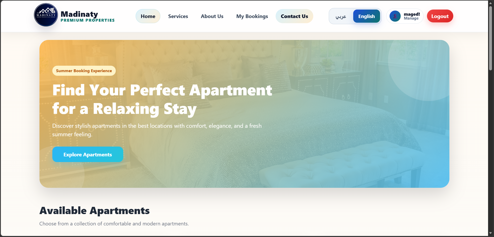
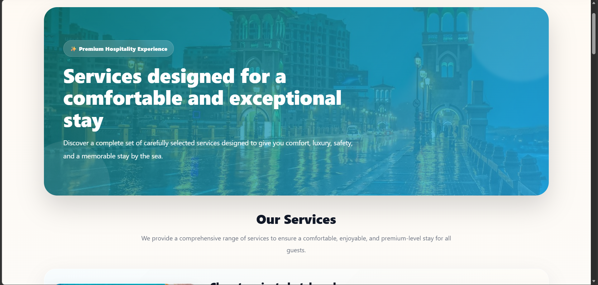
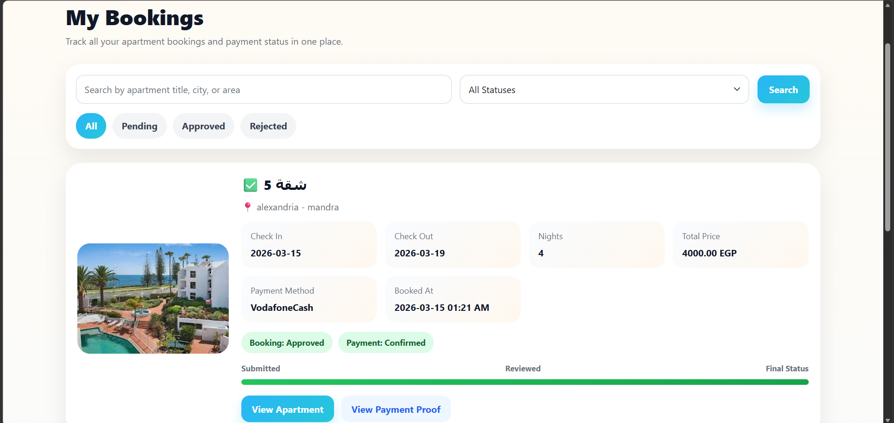
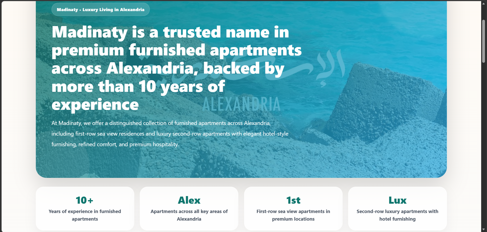
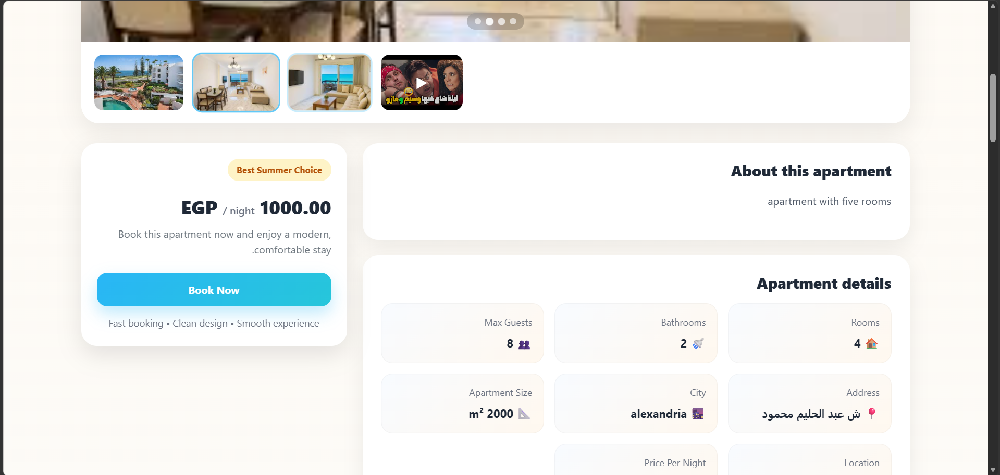
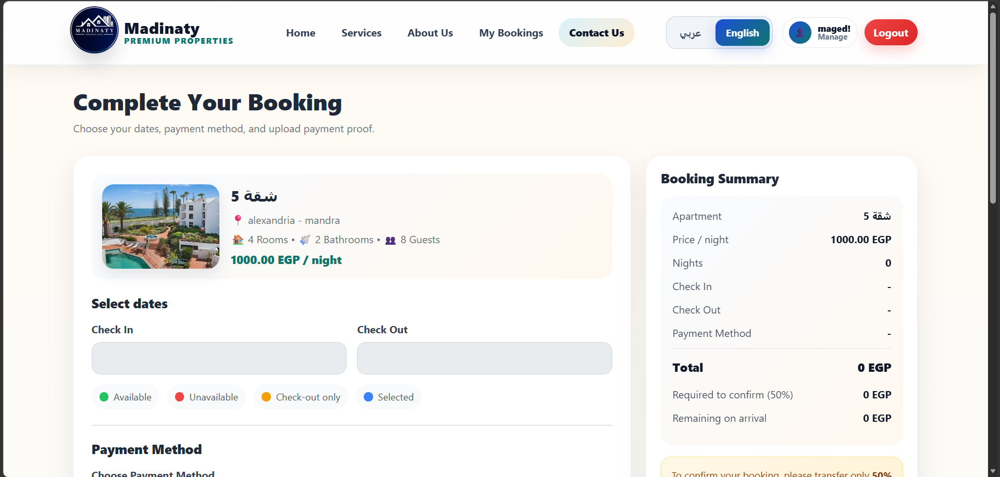
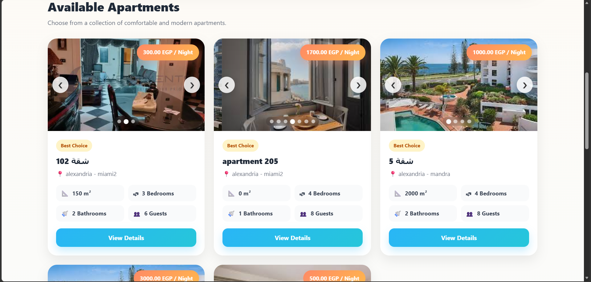
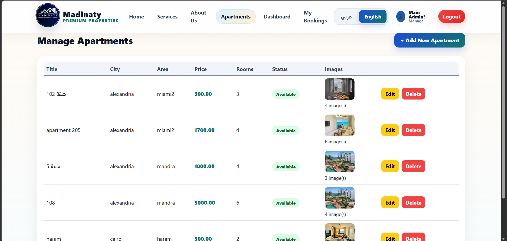

# Madinaty - Apartment Booking System

## 🚀 Features
- Apartment booking with availability validation
- Dynamic pricing calculation
- Admin dashboard
- Localization (EN/AR)

## 🧠 Tech Stack
- ASP.NET Core MVC
- Entity Framework Core
- SQL Server

## 📸 Screenshots
### Home Page

### Services

### My Booking

### Admin Dashboard

### About Us

### Details

### Book Apartment

### available apartment in home page

### Apartment

## ⚙️ How to Run
- Clone repo
- Update connection string
- Run migrations
- Start project

## 🔥 Future Improvements
- Online payment integration
- Notifications system
